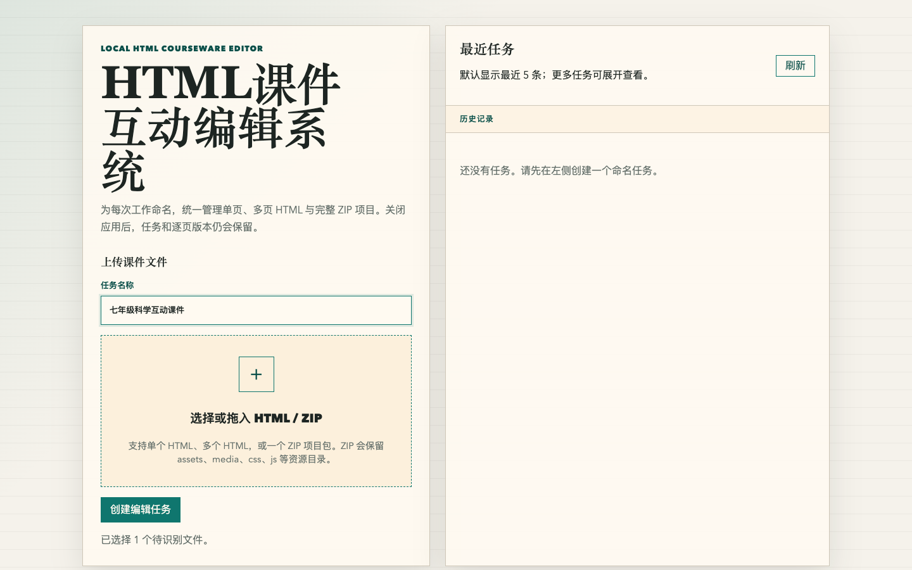
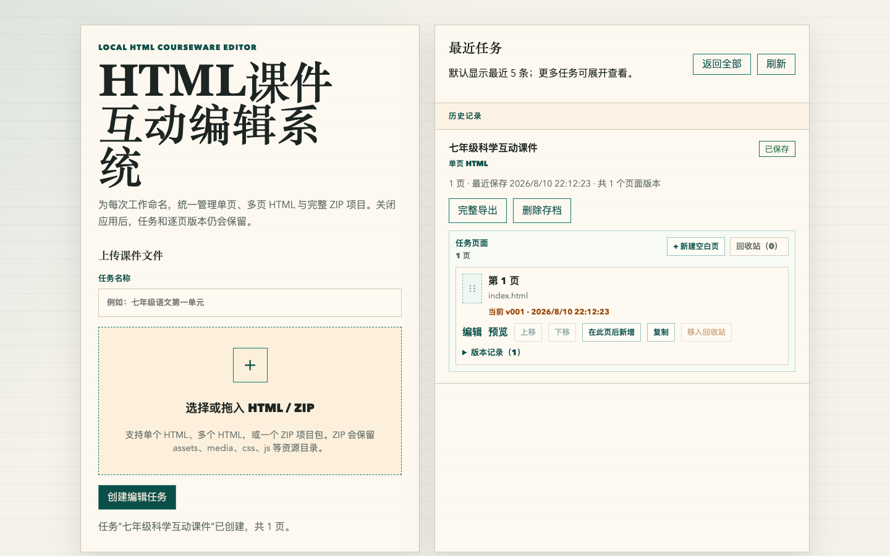
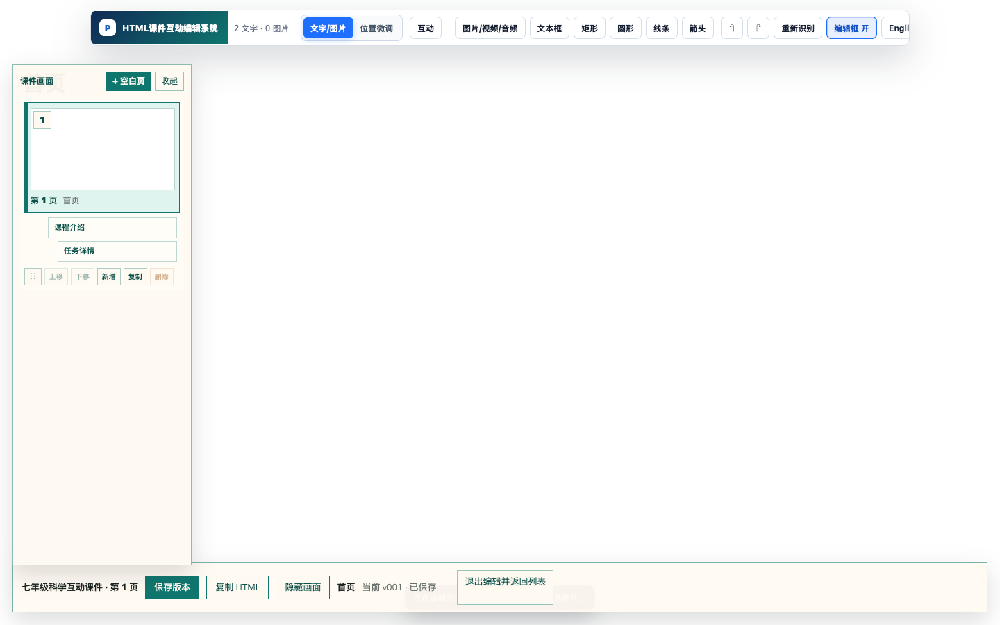
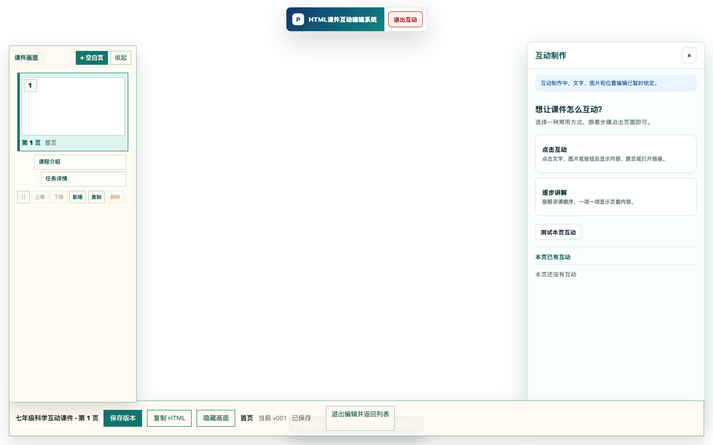
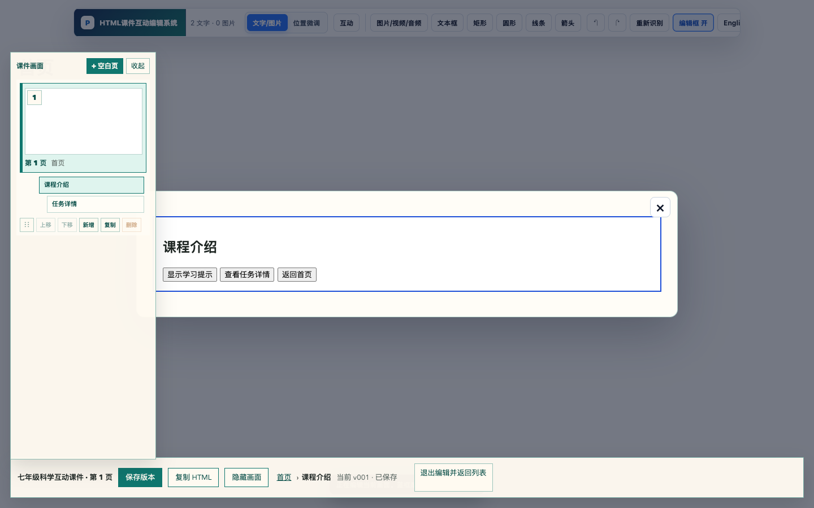
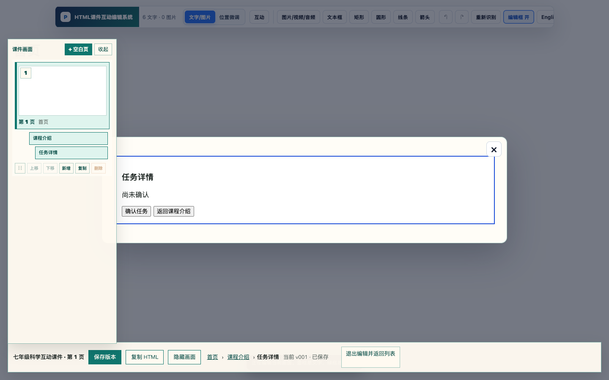
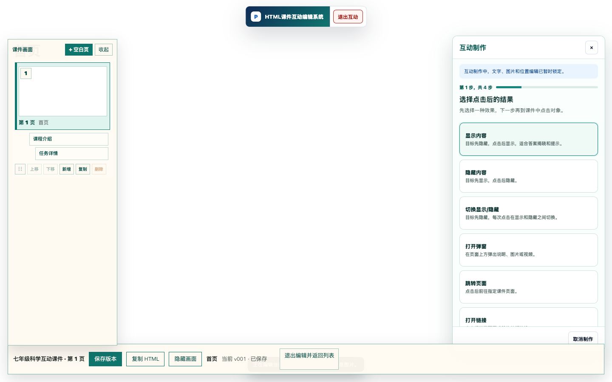

# HTML课件互动编辑系统

## V1.0 用户手册

软件名称：HTML课件互动编辑系统

版本号：V1.0

文档版本：1.0

发布日期：2026年8月

著作权人：____________________

---

## 文档说明

本手册面向使用 HTML 课件进行备课、授课和内容维护的教师及教研人员，介绍 HTML 课件互动编辑系统 V1.0 的安装、课件导入、可视化编辑、互动制作、版本恢复与导出方法。文中界面截图来自 V1.0 实际运行环境，macOS 与 Windows 版本的核心功能和操作流程一致。

### 阅读约定

- “任务”是一次课件编辑工作的集合，可包含一个或多个 HTML 页面及其资源。
- “页面版本”是单个页面每次保存后形成的历史记录。
- “工作区”是软件在本机保存任务、版本和导出文件的目录。
- 按钮名称、菜单名称和界面提示使用中文引号标识。

## 1. 软件概述

### 1.1 产品定位

HTML课件互动编辑系统是一套本地运行的 HTML 课件可视化编辑工具。教师无需直接编写 HTML、CSS 或 JavaScript，即可在接近演示文稿软件的界面中修改文字、图片、音视频、形状、页面布局和教学互动。

系统支持单个 HTML 文件、多个 HTML 文件以及包含资源目录的 ZIP 项目包。课件处理在本机完成，任务、历史版本与导出文件保存在当前用户自己的工作区中。

### 1.2 主要功能

- 创建并管理课件编辑任务。
- 导入单个 HTML、多个 HTML 或完整 ZIP 项目包。
- 编辑文字、图片、音视频、文本框、矩形、圆形、线条与箭头。
- 新增、复制、排序、删除和恢复课件页面。
- 为每个页面保存独立版本，并预览、下载或恢复历史版本。
- 制作 A1 显示/隐藏、A2 打开弹窗、A3 页面跳转、A4 打开链接、A5 逐步讲解等教学互动。
- 在弹窗场景中继续选择对象和制作互动，支持两层弹窗返回。
- 完整导出独立运行的 HTML 或 ZIP，保留 CSS、JavaScript、图片和媒体资源。

### 1.3 运行环境

| 平台 | 支持范围 | 推荐配置 |
| --- | --- | --- |
| macOS | Apple 芯片 Mac（M1、M2、M3、M4 及后续同架构机型） | macOS 13 或更高版本，8 GB 内存，1 GB 可用空间 |
| Windows | 64 位 Windows 安装版与免安装版 | Windows 10/11，8 GB 内存，1 GB 可用空间 |

> 说明：当前 macOS 发布包为 Apple Silicon（arm64）版本。Intel Mac 需要另行生成 x64 构建。

## 2. 安装与启动

### 2.1 macOS 安装

1. 双击 `HTML课件互动编辑系统-版本号-macOS-arm64.dmg`。
2. 将“HTML课件互动编辑系统”拖入“应用程序”文件夹。
3. 在 Finder 的“应用程序”中双击软件图标。

当前版本未使用 Apple Developer 证书签名和公证。若另一台 Mac 首次打开时出现安全提示，请在 Finder 中右键点击应用，选择“打开”，再在确认窗口中选择“打开”。此操作通常只需执行一次。

若获得的是 `.app` 版本，可直接打开 `release/mac-arm64` 中的“HTML课件互动编辑系统.app”。

### 2.2 Windows 安装

系统提供两种 Windows 程序：

- `HTML课件互动编辑系统-Setup-版本号.exe`：安装版，适合长期固定使用。
- `HTML课件互动编辑系统-Portable-版本号.exe`：免安装版，双击即可运行。

使用安装版时，按安装向导完成安装后，从桌面快捷方式或开始菜单启动。使用免安装版时，将 EXE 放在有写入权限的目录中并双击运行。

### 2.3 工作区与隐私

软件继续使用当前用户桌面的 `HTML Mender 工作区` 保存数据。该名称为兼容早期版本而保留，其中包括：

- 已创建的任务及原始课件文件；
- 每个页面的历史版本；
- 页面下载和完整导出的文件；
- 最近任务等工作台数据。

升级或重新打开软件不会主动清空工作区。不要将整个工作区发送给他人，除非确实需要连同项目资料一起共享。仅分发 APP、DMG 或 EXE 不会包含个人课件数据。

## 3. 创建编辑任务

### 3.1 工作台首页

启动软件后进入工作台。左侧用于填写任务名称和选择课件文件，右侧显示最近任务。首次使用时，最近任务区域为空。

### 3.2 选择课件文件

1. 在“任务名称”中输入便于识别的名称，例如“七年级科学互动课件”。
2. 点击或拖入文件选择区域。
3. 选择一个 HTML、多个 HTML，或一个 ZIP 项目包。
4. 确认下方出现“已选择 1 个待识别文件”等提示。
5. 点击“创建编辑任务”。

导入 ZIP 时，系统会保留包内的 `assets`、`media`、`css`、`js` 等资源目录。为减少兼容问题，建议 ZIP 中使用相对路径引用资源，并确保至少包含一个可打开的 HTML 页面。

### 3.3 最近任务

创建或保存过的任务会出现在右侧“最近任务”中。重新启动软件后，可直接从这里继续编辑。若任务较多，可展开历史记录或使用“刷新”更新列表。

## 4. 任务、页面与版本管理

### 4.1 任务卡片

任务卡片显示任务名称、项目类型、页面数量、最近保存时间和保存状态。主要入口包括：

- “完整导出”：输出可独立运行的 HTML 或 ZIP。
- “删除存档”：删除当前任务的本地存档，操作前应确认不再需要。
- “编辑”：进入所选页面的可视化编辑器。
- “预览”：以接近最终使用效果的方式打开页面。
- “版本记录”：展开页面的历史保存版本。

### 4.2 页面操作

多页课件支持以下操作：

- “新建空白页”：在任务中增加一个空白 HTML 页面。
- “在此页后新增”：在当前页后插入新页面。
- “复制”：复制当前页及其页面内容。
- “上移/下移”：调整页面顺序。
- “移入回收站”：暂时移除页面。
- “回收站”：查看并恢复已移除页面。

### 4.3 页面版本

每个页面拥有独立版本。进入编辑器后点击“保存版本”，系统会记录当前页面状态。版本记录可用于：

- 预览某个历史版本；
- 下载历史版本文件；
- 将历史版本恢复为当前版本。

恢复前建议先保存当前页面，避免未保存修改丢失。恢复操作完成后，再次进入编辑器检查页面和互动是否符合预期。

## 5. 可视化编辑器

### 5.1 界面组成

编辑器由顶部工具栏、左侧页面栏、中央画布和底部状态栏组成。

- 顶部工具栏：切换文字/图片、位置微调、互动制作和图形插入等工具。
- 左侧页面栏：选择页面、场景或弹窗内容，新增、复制和排序页面。
- 中央画布：选择和编辑课件中的实际对象。
- 底部状态栏：保存版本、复制 HTML、隐藏画面、切换当前页面和返回任务列表。

### 5.2 文字和图片

点击画布中的文字或图片后，可在“文字/图片”工具中修改内容和资源。编辑时应注意：

- 文字修改后检查换行、字号和容器高度。
- 替换图片后检查裁切、比例和清晰度。
- 不要删除页面运行必需但视觉上暂时不可见的脚本或资源节点。

### 5.3 位置微调与图形

“位置微调”用于精确移动已选对象。工具栏还可插入文本框、矩形、圆形、线条和箭头。新增对象后，建议先完成内容与位置，再制作互动，以便选择目标时更容易识别。

### 5.4 撤销、重做和重新识别

顶部的撤销、重做按钮用于回退或恢复当前编辑操作。“重新识别”会重新分析页面结构；当课件结构较复杂或对象列表与画面不一致时使用。执行重新识别前建议先保存版本。

## 6. 教学互动制作

### 6.1 进入互动模式

点击顶部“互动”按钮后，右侧出现“互动制作”面板。互动制作期间，文字、图片和位置编辑会暂时锁定。完成或取消互动后可返回普通编辑状态。

系统提供“点击互动”和“逐步讲解”两类入口。“测试本页互动”用于在编辑状态下预览当前页的互动结果。

### 6.2 A1 显示、隐藏和切换

A1 用于点击一个对象后显示、隐藏或切换另一个对象的可见状态。

1. 进入“互动”并选择“点击互动”。
2. 选择“显示内容”“隐藏内容”或“切换显示/隐藏”。
3. 按界面提示在画布中点击触发对象。
4. 点击需要显示或隐藏的目标对象。
5. 确认并保存互动。
6. 使用“测试本页互动”验证效果。

### 6.3 A2 打开弹窗

A2 用于点击按钮后打开一层弹窗，也可在第一层弹窗内继续配置按钮，打开第二层弹窗。例如：

“首页 → 课程介绍弹窗 → 点击‘查看任务详情’ → 任务详情弹窗”。

配置方法：

1. 在点击结果中选择“打开弹窗”。
2. 在当前场景中选择触发按钮。
3. 选择要作为弹窗内容的页面区域或场景。
4. 进入弹窗场景后，可继续选择弹窗内部按钮并配置第二层弹窗。
5. 在编辑状态下测试打开、关闭以及 Esc 返回。
6. 关闭第二层后应回到第一层，第一层的滚动位置、表单输入和互动状态会保留。
7. 保存版本后关闭并重新打开任务，再验证配置是否仍然存在。

### 6.4 A3 页面跳转

A3 用于点击对象后跳转到同一课件任务中的另一页面。

1. 在点击结果中选择“跳转页面”。
2. 选择触发对象。
3. 从页面列表中选择目标页。
4. 保存后测试正向跳转和返回路径。

页面重排后应重新测试跳转，确认目标仍是预期页面。

### 6.5 A4 打开链接

A4 用于点击对象后打开指定网址。配置时输入完整链接，例如 `https://example.com`。发布前应确认：

- 链接协议为 `https://` 或明确允许的地址；
- 地址可访问且无拼写错误；
- 在实际授课网络环境中能够打开；
- 链接内容适合向学生展示。

### 6.6 A5 逐步讲解

A5 按指定顺序逐项显示页面内容，适合分步呈现答案、推导过程或知识点。

1. 在互动首页选择“逐步讲解”。
2. 按讲解顺序依次点击目标对象。
3. 检查右侧步骤列表并调整顺序。
4. 保存后从第一步开始完整测试。

### 6.7 点击结果选项

点击互动面板集中列出 A1 至 A4 的结果选项。不同结果的触发对象可以是文字、图片或按钮。

## 7. 弹窗场景编辑与状态返回

打开弹窗场景后，左侧会突出显示当前场景，底部面包屑显示“首页、课程介绍、任务详情”等层级。编辑对象前，应先确认当前面包屑位置，避免把修改应用到错误场景。

弹窗关闭规则如下：

- 点击当前层右上角关闭按钮，返回上一层场景。
- 按 Esc，关闭最上层弹窗并返回上一层。
- 关闭第二层后，第一层保持打开。
- 返回第一层时，保留其滚动、表单和互动状态。
- 退出弹窗场景后，仍可通过左侧场景入口再次进入编辑。

完成嵌套弹窗后，至少进行一次“第一层打开 → 第二层打开 → Esc 返回第一层 → 关闭第一层 → 重新打开”的完整测试。

## 8. 保存、重开与版本恢复

### 8.1 保存版本

编辑完成后点击底部“保存版本”。看到状态更新为“已保存”后再退出编辑器。对关键修改建议分阶段保存，例如：

1. 完成基础内容后保存一次；
2. 完成 A1 至 A5 互动后保存一次；
3. 完成最终验收后再保存一次。

### 8.2 关闭并重开验证

保存后退出编辑器并返回任务列表，重新进入同一页面，检查文字、图片、页面顺序和互动配置。对于嵌套弹窗，应重新测试两层打开和返回路径。

### 8.3 恢复历史版本

在任务卡片中展开“版本记录”，选择目标版本并执行恢复。恢复后进入编辑器检查页面。若恢复结果不符合预期，可从其他历史版本再次恢复。

## 9. 预览与导出

### 9.1 页面预览

任务列表中的“预览”用于快速检查单页效果。互动编辑中的“测试本页互动”用于验证触发、弹窗、跳转和逐步讲解。正式交付前应同时完成编辑态测试和导出文件测试。

### 9.2 完整导出

点击任务卡片中的“完整导出”，系统会打开“另存为”窗口，由用户选择保存目录和文件名。

- 单页任务通常导出一个 HTML 文件。
- 多页或包含资源的项目通常导出一个 ZIP 文件。
- 导出结果不再额外生成带 `.editable.html` 后缀的重复文件。
- ZIP 会保留课件所需的 CSS、JavaScript、图片和媒体资源。

### 9.3 独立运行检查

导出后按以下顺序验收：

1. 将导出文件复制到一个不依赖工作区的新目录。
2. HTML 文件直接双击打开；ZIP 文件先完整解压，再双击入口 HTML。
3. 检查文字、图片、音视频和页面样式。
4. 依次测试 A1 至 A5 互动。
5. 测试第一层、第二层弹窗的打开、Esc 返回和关闭。
6. 检查页面跳转和外部链接。

如果只在编辑器中正常、导出后异常，优先检查资源是否使用了本机绝对路径。课件资源应使用相对路径并随 ZIP 一起分发。

## 10. 常见问题

### 10.1 macOS 提示无法验证开发者

当前包未签名和公证。请在 Finder 中右键应用并选择“打开”，再确认一次。若单位设备受管理策略限制，请联系管理员，或使用已签名公证的正式发布包。

### 10.2 关闭软件后任务是否会丢失

不会。已创建任务、页面版本和工作台记录保存在桌面的 `HTML Mender 工作区`。未点击“保存版本”的临时修改可能不会形成历史版本，因此退出前应先保存。

### 10.3 导出后图片或音视频丢失

检查原课件是否使用本机绝对路径、资源是否位于 ZIP 中，以及文件名大小写是否一致。建议将所有资源放在项目内部目录，并使用相对路径引用。

### 10.4 互动点击没有反应

确认已选择正确的触发对象和目标对象，互动配置已保存，并在“测试本页互动”中重新测试。复杂页面可先保存版本，再使用“重新识别”刷新对象结构。

### 10.5 第二层弹窗关闭后没有回到第一层

检查第二层是否由第一层内部按钮触发，以及场景面包屑是否显示正确层级。重新进入第一层，按“打开第二层 → Esc → 关闭第一层”的顺序测试。

### 10.6 导出时看到两个相似 HTML 文件

V1.0 的完整导出仅保留用户需要的最终 HTML 或 ZIP，不再同时输出带 `.editable.html` 后缀的重复文件。若仍看到旧文件，请确认目录中是否残留早期版本导出结果，并使用不同文件名重新导出验证。

### 10.7 Windows 安装版和免安装版能否同时使用

可以，但两者会使用同一用户桌面的 `HTML Mender 工作区`。不要同时编辑同一个任务，以免保存顺序相互覆盖。

## 11. 使用与维护建议

- 重要修改前先保存一个版本。
- 对导入的原始 ZIP 保留独立备份。
- 任务名称中包含学段、学科和课题，便于检索。
- 正式授课前，在实际使用电脑上测试导出文件。
- 不要把个人课件工作区直接打入软件安装包。
- 版本升级前备份 `HTML Mender 工作区`。

## 附录 A 快速验收清单

- [ ] macOS 或 Windows 程序可以正常启动。
- [ ] 能创建任务并导入 HTML/ZIP。
- [ ] 文字、图片、页面顺序修改可以保存。
- [ ] 关闭并重开后配置仍存在。
- [ ] 页面版本可以预览和恢复。
- [ ] A1 显示/隐藏/切换正常。
- [ ] A2 第一层、第二层弹窗及 Esc 返回正常。
- [ ] A3 页面跳转目标正确。
- [ ] A4 外部链接可打开。
- [ ] A5 逐步讲解顺序正确。
- [ ] 完整导出只生成所需的一个 HTML 或一个 ZIP。
- [ ] 导出文件离开工作区后仍可双击独立运行。

## 附录 B 文档与版权信息

软件名称：HTML课件互动编辑系统

软件版本：V1.0

文档名称：HTML课件互动编辑系统 V1.0 用户手册

著作权人：____________________

编制日期：2026年8月

本手册随 HTML课件互动编辑系统 V1.0 提供。未经著作权人许可，不得将本手册用于与本软件无关的商业用途。
